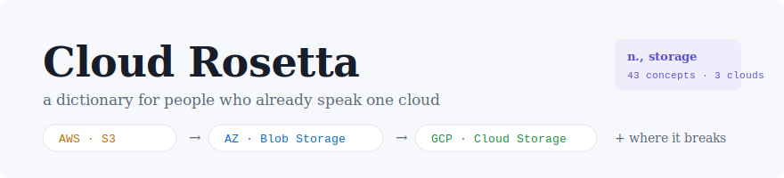

<p align="center">
  
</p>

<p align="center">
  <a href="#"></a>
  <a href="LICENSE"></a>
  
  
</p>

# Cloud Rosetta

**An interactive cross-cloud dictionary for engineers who are fluent in one cloud and need to work in another.**

Pick the cloud you think in — AWS, Azure, or GCP — and every concept re-anchors to *your* vocabulary. Each entry translates the service names, explains **where the analogy quietly breaks**, and maps the Terraform resource on all three providers, with a link to the official registry docs as proof.

**Live site:** `https://edeak54.github.io/cloud-rosetta/`

---

## Why another comparison table?

Static mapping charts (Google's own table, the excellent community cheat sheets) tell you `S3 = Blob Storage` and stop. That's where the useful part *starts*:

- Azure puts a **Storage Account** above the container — the account owns networking, keys, and replication, so an S3-shaped Terraform module won't port.
- A GCP VPC is **global**; an AWS VPC is regional. "Just create a VPC" means different things on each cloud.
- GCP has **no SQS**. A Pub/Sub topic + pull subscription plays the queue role.
- `aws_iam_role` translates to **no resource at all** on Azure — the permission model itself is different.

Cloud Rosetta encodes those breaks as first-class content, not footnotes.

## Features

- **Dialect lens** — "I speak AWS / Azure / GCP / Neutral." Your native cloud becomes the headword; the others become translations.
- **Where the analogy breaks** — every entry has a usage note calling out the trap that bites during real migrations.
- **Terraform layer** — `aws_lb` ↔ `azurerm_application_gateway` ↔ `google_compute_url_map`, click-to-copy, each linked to its official Terraform Registry docs page.
- **Full-text search** — service names, descriptions, gotchas, and Terraform resource names are all searchable (`"bucket"`, `"VNet"`, `"aws_nat_gateway"`).
- **Single-file output** — the entire site builds to one self-contained `index.html`. No framework, no tracker, no runtime dependency, loads instantly, works offline.

## Architecture

The single HTML file people see is a **build artifact**, not the source of truth:

```
data/entries.json     ← the dictionary (the actual asset — PRs welcome)
src/template.html     ← page shell
src/styles.css        ← design system
src/app.js            ← lens / search / render logic
build.js              ← assembles everything into dist/index.html
tests/                ← data validation (node --test, zero deps)
.github/workflows/    ← CI: validate → build → deploy to GitHub Pages
```

Every push to `main` runs the data-validation suite (entries must be fully trilingual, every entry must document where the analogy breaks, Terraform names must carry the right provider prefix) and, only if it passes, builds and deploys to GitHub Pages.

## Develop

```bash
npm test        # validate the dictionary data
npm run build   # produce dist/index.html
npm run dev     # build + serve locally
```

Node ≥ 18. No dependencies to install.

## Contributing

The highest-value contribution is a **new entry or a sharper gotcha** in `data/entries.json` — see [CONTRIBUTING.md](CONTRIBUTING.md) for the entry schema. Corrections from people with production scars on the "minority" cloud of any entry are especially welcome.

## Related

- [`tfrosetta`](../tfrosetta) — the CLI companion: converts actual AWS Terraform modules into annotated Azure/GCP equivalents, built on the same knowledge-base philosophy.

## Disclaimer

Mappings are functional equivalents, not feature or price parity. The dictionary tells you where to look and what will surprise you; always confirm against the target cloud's documentation (that's why every Terraform chip links to it) before you architect.

## License

[Apache-2.0](LICENSE)
